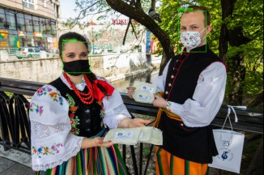

# Face mask detection

This repository contains a project devoted to detect face masks in the images. The solution is 
composed of two steps - first, a face detector (pretrained Caffe model, downloaded from
[here](https://github.com/gopinath-balu/computer_vision/blob/master/CAFFE_DNN/res10_300x300_ssd_iter_140000.caffemodel)) recognizes faces in the image
and draws bounding boxes around them. Next, these bounding boxes are cropped from the image and passed sequentially to the classification model, trained in binary
mode. The classifier checks, whether the person in the image wears a mask or not. This way, the system can spot people in the image with masks and
without masks.

## Methods
The solution was implemented mainly by using OpenCV and Tensorflow libraries. As stated previously, for face
detection, a pretrained model based on ResNet architecture was used. For classification, a MobileNet V2 architecture
available from Keras API was used and trained.

## Next steps
The solution could be extended to the video-mode. This application would be useful in real-world, as the system could be embedded into supervision cameras, which
will notify about persons not wearing masks (and i.e. entering a building).

### Endnote
Feel free to check my other projects on my [Github Pages Site](https://wprazuch.github.io/).
